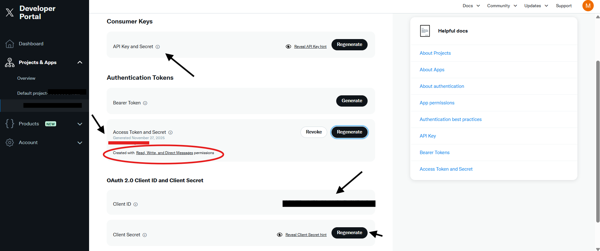

# X API Challenge: Post Publisher

## 🎯 Objective

Build a solution in **any programming language or framework** that can successfully publish a post through the X API (formerly Twitter API). This is an open-ended challenge designed to test your API integration skills, creativity, and software development practices.

## 📋 Challenge overview

**Core Goal:** Create an application capable of publishing at least one post to X (Twitter).

**Approach:** You have complete freedom in how you implement this solution. Whether you build a CLI tool, web application, mobile app, or automated service - the choice is yours!

---

## 🔑 Prerequisites & Setup

This section will guide you step-by-step through setting up your X API credentials. **Follow these instructions carefully** - this is often the trickiest part!

### Step 1: Create an X developer account

1. **Go to the X developer portal**
   - Visit [developer.x.com](https://developer.x.com)
   - Click "Sign up" or "Apply for a developer account"

2. **Apply for developer access**
   - You'll need an existing X (Twitter) account
   - Fill out the application form:
     - **Use case**: Select "Hobbyist" → "Making a bot"
     - **Description**: Explain this is a **student project** for learning API integration
     - Example: *"I am a student working on a course project to learn how to integrate with REST APIs. I will build a simple application to post to X programmatically as part of my API development coursework."*
   - Be honest and specific - vague applications may be rejected
   - **Free tier is sufficient** for this challenge

3. **Wait for approval**
   - Free tier (Essential Access) approval is instant - you can start immediately
   - Elevated Access (paid tiers) may take up to 2 weeks for review
   - Check your email for confirmation

### Step 2: Create a project and app

Once your developer account is approved:

1. **Access the developer portal**
   - Go to [developer.x.com/en/portal/dashboard](https://developer.x.com/en/portal/dashboard)
   - Log in with your X account

2. **Create a new project** (if you don't have one)
   - Click "Create Project"
   - **Project name**: e.g., "Student API Project"
   - **Use case**: Select "Making a bot"
   - **Description**: Brief description of your learning goals

3. **Create an app within the project**
   - Click "Create App" or "+ Add App"
   - **App name**: e.g., "Post Publisher" (must be unique across all X apps)
   - **Description**: "Course project for API development"
   - Click "Complete"

4. **Configure app settings**
   - After creating the app, you'll see the app dashboard
   - Go to "Settings" tab
   - Scroll to "User authentication settings" and click "Set up"

5. **Configure authentication settings** (CRITICAL STEP!)

   **App permissions:**
   - ✅ Select **"Read and Write"** (minimum required)
   - Or select **"Read and Write and Direct Messages"** if you want full access
   - ❌ Do NOT select "Read-only" - you won't be able to post!

   **Type of app:**
   - Select **"Web App, Automated App or Bot"**

   **App info:**
   - **Callback URI / Redirect URL**: `http://127.0.0.1:3000/callback` (required field, though not used for pre-generated tokens)
   - **Website URL**: `http://127.0.0.1:5000` or your GitHub repo URL

   Click "Save"

### Step 3: Generate your API credentials

Now you need to obtain four credentials. Here's what the portal looks like:



**You need these four credentials:**

1. **API Key** (also called Consumer Key)
2. **API Secret** (also called Consumer Secret)
3. **Access Token**
4. **Access Token Secret**

#### Finding your credentials in the portal:

Navigate to your App → **"Keys and Tokens"** tab. You'll see three sections:

**Section 1: Consumer Keys (API Key and Secret)**
- Click **"Reveal API Key hint"** or **"Regenerate"** to view
- Copy both:
  - `X_API_KEY` = API Key
  - `X_API_SECRET` = API Secret Key
- **Save these immediately** - you can't view the secret again!

**Section 2: Authentication Tokens (Access Token and Secret)**
- This is what you need for posting to X!
- Click **"Generate"** if you haven't created tokens yet
- Or click **"Regenerate"** to create new ones
- **CRITICAL**: After generating, verify it says:

  ✅ **"Created with Read, Write, and Direct Messages permissions"**

  (See red highlight in the screenshot above)

- If it says "Read-only permissions", you must:
  1. Go back to App Settings → User authentication settings
  2. Change permissions to "Read and Write"
  3. Save
  4. Come back and **Regenerate** the tokens

- Copy both:
  - `X_ACCESS_TOKEN` = Access Token
  - `X_ACCESS_TOKEN_SECRET` = Access Token Secret
- **Save these immediately** - you can't view them again!

**Section 3: OAuth 2.0 Client ID and Secret**
- You DON'T need these for this challenge (we use OAuth 1.0a)
- You can ignore this section

#### Save your credentials securely

Create a text file (temporarily) or password manager entry with:
```
X_API_KEY=your_api_key_here
X_API_SECRET=your_api_secret_here
X_ACCESS_TOKEN=your_access_token_here
X_ACCESS_TOKEN_SECRET=your_access_token_secret_here
```

**DO NOT:**
- ❌ Share these with anyone
- ❌ Post them in Discord/Slack/forums
- ❌ Commit them to Git (we'll configure `.gitignore` later)
- ❌ Include them in screenshots

### Step 4: Verify your setup

Before you start coding, verify your credentials:

**Checklist:**
- ✅ You have all 4 credentials (API Key, API Secret, Access Token, Access Token Secret)
- ✅ Your Access Token was created with **"Read and Write"** or **"Read and Write and Direct Messages"** permissions
- ✅ You've saved the credentials somewhere secure
- ✅ Your app is part of a Project in the Developer Portal

**Common Issues:**

| Problem | Solution |
|---------|----------|
| "Read-only permissions" on Access Token | Go to App Settings → User auth settings → Change to "Read and Write" → Regenerate tokens |
| Can't find "Keys and Tokens" tab | Make sure you're viewing your App (not Project). Click on your App name. |
| "Forbidden" error when posting | Regenerate Access Token after changing permissions |
| Lost my credentials | You can regenerate them anytime in the portal (but old ones stop working) |

### Step 5: Understand free tier limitations

Your free X API account has these limits:

**Post Limits:**
- ✅ 17 posts per 24 hours (~510 posts per month maximum)
- ✅ Basic media uploads (images)

**Restrictions:**
- ❌ Very limited read operations (timeline, search)
- ❌ No analytics or metrics
- ❌ No streaming API
- ❌ No webhooks FROM X (but you can send webhooks TO your service!)

**💡 Pro Tip**: Build your application with **mock/test mode** first! Only connect to the real API when you're confident your code works. This saves your precious API quota.

### Step 6: Prepare your development environment

Now you're ready to code!

**Choose your tools:**
- Programming language of your choice
- Code editor (VS Code, PyCharm, IntelliJ, etc.)
- Git for version control
- Environment variable management (`.env` files)

**Recommended reading:**
- [X API v2 Documentation](https://docs.x.com/x-api/getting-started/about-x-api)
- [Manage Posts Endpoint](https://docs.x.com/x-api/posts/manage-tweets/introduction)
- [Rate Limits Guide](https://docs.x.com/x-api/fundamentals/rate-limits)

---

## 🎓 Need Help?

**If you get stuck during setup:**

1. **Check the X API documentation**: [developer.x.com/en/docs](https://developer.x.com/en/docs)
2. **Verify your app permissions**: Must be "Read and Write" or higher
3. **Regenerate tokens**: If you changed permissions, regenerate Access Tokens
4. **Ask your instructor**: Bring screenshots of your Developer Portal (hide credentials!)

**Don't spend hours stuck on setup** - reach out for help early!

---

## ✅ Core requirements

Your solution **MUST**:

1. **Authenticate** with the X API using valid credentials
2. **Publish a post** successfully (minimum 1 character, maximum 280 characters)
3. **Handle errors** gracefully (invalid credentials, rate limits, network errors)
4. **Protect secrets** - Use environment variables or secure configuration files
5. **Include documentation** - README with setup instructions

---

## 🚀 Optional enhancements

You're encouraged to extend your solution as much as you can! Here are ideas based on concepts you've learned throughout the course. **All suggestions below are compatible with the X API free tier:**

### Basic enhancements

**Input Validation & Error Handling** *(Exercise 03 - API Fundamentals)*
- Validate post length before sending (1-280 characters)
- Check for empty or whitespace-only posts
- Validate JSON payloads if you're building an API wrapper
- Return appropriate HTTP status codes (200, 201, 400, 401, 429, 500)
- Handle X API rate limit errors (HTTP 429) gracefully
- Provide meaningful error messages to help you debug issues

**User Feedback & Local Storage**
- Display confirmation prompt before posting ("Are you sure you want to post this?")
- Show success message with timestamp after posting
- Store published posts locally (JSON file, CSV, or in-memory)
- Display count of remaining API calls (track locally based on your usage)

**Development Mode**
- **Test/Mock mode**: Allow posting to a local file instead of X API during development (this saves your API quota!)
- **Dry-run flag**: Preview what would be posted without actually posting
- **Environment toggle**: Switch between "development" (mock) and "production" (real API)

### Intermediate enhancements

**Build Your Own API Wrapper** *(Exercises 04, 05, 06)*

Since you can't use X's advanced features, build your own API around the post publishing functionality! This lets you practice the authentication methods you learned:

- **Basic Authentication**: Protect your post publishing endpoints with Basic Auth (like Exercise 04)
- **API Key Authentication**: Generate and validate API keys for your service (like Exercise 05)
- **JWT Tokens**: Use JWT to manage sessions if you have multiple users (like Exercise 06)

**Example architecture:**
```
Your Web App (with auth) → Your Backend API → X API
                ↓
        JWT/API Key/Basic Auth
```

**CRUD Operations on Post Drafts** *(Exercise 08)*

The X API free tier has very limited read capabilities, but you can implement CRUD on **local post drafts**:

- **Create**: Save post drafts to a database or file
- **Read**: List all your saved drafts
- **Update**: Edit drafts before posting
- **Delete**: Remove drafts you don't want

Once a draft is ready, post it to X!

**Pagination on Local Data** *(Exercise 09)*
- Implement pagination for your post history stored locally
- Paginate through saved drafts
- Use offset/limit or cursor-based pagination patterns

**Enhanced Input Features**
- **Post templates**: Pre-defined formats (e.g., "Daily update: {content}")
- **Variable substitution**: Replace {date}, {time}, {user} in templates
- **Hashtag suggestions**: Auto-append configured hashtags
- **Thread helper**: Split long text into multiple 280-char posts (stored as drafts)

### Advanced enhancements

**Local Scheduling System**
- **Schedule posts**: Store posts with future timestamps in a local database
- **Cron job or task scheduler**: Check scheduled posts and publish when time arrives
- **Queue management**: View, edit, or cancel scheduled posts
- **Recurring posts**: Post the same content daily/weekly (useful for reminders)

**Web Interface for Your Service**
- **Frontend**: Build a UI for composing and publishing posts
- **Draft management**: Visual interface to create, edit, and organize drafts
- **Schedule calendar**: Display scheduled posts on a calendar view
- **Local history**: Show posts you've published (from your local storage)

**Role-Based Access Control** *(Exercise 10 - Roles & Permissions)*

If you're building a multi-user system:

- **Multiple user roles**: Admin, Editor, Viewer
- **Permission levels**: Who can post immediately, who can only save drafts, who can schedule
- **Approval workflow**: Editors create drafts, Admins approve and post
- **Access restrictions**: Protect sensitive operations based on user roles

**Public API Exposure & Webhooks** *(Exercise 11 - ngrok)*

Note: X API free tier doesn't support webhooks FROM X, but you can create webhooks TO your service:

- **Expose your API publicly**: Use ngrok to make your post publisher accessible to others
- **Receive webhooks**: Let external services trigger posts via your API (GitHub commits, form submissions, payment confirmations)
- **Event-driven posting**: Your service receives webhook → validates → posts to X

**Example flow:**
```
GitHub Webhook → Your API (ngrok) → Validates & formats → Posts to X API
```

**API Documentation** *(Exercise OpenAPI - Swagger)*
- **OpenAPI/Swagger**: Document your API endpoints with interactive documentation
- **Auto-generated docs**: Use tools like Flask-RESTX, Swagger UI, Redoc, Springdoc
- **Try-it-out feature**: Allow users to test your API directly from the docs
- **Example requests**: Provide sample payloads for all endpoints

**Content Generation & Integration** *(Exercise 07 - Public APIs)*

You can consume FREE public APIs and post about their data:

- **Weather updates**: Fetch from OpenWeatherMap and post daily weather
- **News headlines**: Get news from NewsAPI or RSS feeds and post summaries
- **Random facts**: Use public fact APIs to post interesting content
- **Cryptocurrency prices**: Fetch from CoinGecko and post price updates
- **Quote of the day**: Random quote APIs
- **NASA picture of the day**: Post astronomy content

**Database Integration**
- **Store everything**: Users, drafts, scheduled posts, post history, API usage stats
- **Database options**: SQLite (simple), PostgreSQL, MySQL, MongoDB
- **ORM usage**: SQLAlchemy (Python), Sequelize (Node.js), Entity Framework (.NET)
- **Data persistence**: Survive application restarts

**Media Support**
- **Image uploads**: Attach images to posts (supported on free tier with media.write scope)
- **Image preview**: Show image before posting
- **Image validation**: Check file size, format, dimensions
- **Alt text**: Add accessibility descriptions to images
- **Note**: X API v2 media upload endpoints are available; v1.1 media endpoints will be deprecated June 9, 2025

**Testing & Quality**
- **Unit tests**: Test your business logic (validation, formatting, scheduling)
- **Integration tests**: Test your API endpoints (with mocked X API)
- **Mock X API responses**: Use libraries to simulate X API during testing
- **CI/CD pipeline**: Automated testing on commits (GitHub Actions, GitLab CI)

---

## 🔒 Security requirements

**CRITICAL: Never commit API keys or secrets to your repository!**

### Protecting your credentials

You've learned about protecting sensitive data throughout the course. Here's how to apply it:

1. **Use environment variables**
   ```bash
   # Example .env file (DO NOT COMMIT THIS)
   X_API_KEY=your_api_key_here
   X_API_SECRET=your_api_secret_here
   X_ACCESS_TOKEN=your_access_token_here
   X_ACCESS_TOKEN_SECRET=your_access_token_secret_here

   # Optional: Mode toggle
   APP_MODE=development  # or 'production'
   ```

2. **Add `.env` to `.gitignore`**
   ```
   # .gitignore
   .env
   .env.local
   .env.production
   config.json
   secrets.yml
   *.key
   *.pem
   credentials.txt
   x_api_keys.txt
   ```

3. **Provide template files**

   Create `.env.example`:
   ```bash
   # .env.example
   X_API_KEY=your_api_key_here
   X_API_SECRET=your_api_secret_here
   X_ACCESS_TOKEN=your_access_token_here
   X_ACCESS_TOKEN_SECRET=your_access_token_secret_here
   APP_MODE=development
   ```

4. **Document setup in README**

   Explain step-by-step:
   - Copy `.env.example` to `.env`
   - Fill in your actual credentials from X Developer Portal
   - Never share or commit the `.env` file

**Remember:** If you accidentally commit secrets:
1. **Immediately** revoke them in the X Developer Portal
2. Generate new credentials
3. Remove them from Git history using `git-filter-repo` or BFG Repo-Cleaner
4. Update your `.gitignore` to prevent future accidents

### Loading environment variables in your code

Here are practical examples of how to load your `.env` file in different programming languages:

#### Python

Install the library:
```bash
pip install python-dotenv
```

Load environment variables:
```python
from dotenv import load_dotenv
import os

# Load environment variables from .env file
load_dotenv()

# Access your credentials
X_API_KEY = os.getenv('X_API_KEY')
X_API_SECRET = os.getenv('X_API_SECRET')
X_ACCESS_TOKEN = os.getenv('X_ACCESS_TOKEN')
X_ACCESS_TOKEN_SECRET = os.getenv('X_ACCESS_TOKEN_SECRET')

# Optional: Check if running in development mode
APP_MODE = os.getenv('APP_MODE', 'production')  # default to 'production'

if not all([X_API_KEY, X_API_SECRET, X_ACCESS_TOKEN, X_ACCESS_TOKEN_SECRET]):
    raise ValueError("Missing required environment variables. Check your .env file.")

print(f"Running in {APP_MODE} mode")
```

#### Important notes

- Always call the dotenv loader **at the very beginning** of your application
- The `.env` file should be in your project root directory (same level as your main script)
- Environment variables are loaded into your system's environment, not returned as a dictionary
- If a variable is already set in your system environment, the `.env` file won't override it (in most libraries)

---

## 📦 Submission guidelines

### What to include

1. **Source code**
   - Well-organized project structure
   - Clear file and folder naming
   - Clean, readable code following best practices for your language
   - Comments explaining logic

2. **README.md** must include:
   - **Project title and description**
   - **Features you implemented** (list them clearly)
   - **Technologies used** (language, framework, libraries)
   - **Prerequisites** (Python 3.x, Node.js, etc.)
   - **Installation steps** (step by step, assume the reader knows nothing)
   - **Configuration instructions** (how to set up `.env`)
   - **Usage examples** (how to run the app, example commands)
   - **Screenshots or GIFs** (show your app in action!)
   - **Course concepts applied** (what inspired your features)
   - **API limitations** (mention free tier constraints you worked around)
   - **Known issues or limitations**
   - **Future improvements** (what would you add with more time)

3. **Configuration template**
   - `.env.example` with all required variables
   - Clear comments explaining each variable

4. **Additional documentation** (if applicable)
   - API endpoints documentation (if you built a web API)
   - Architecture diagrams (how components interact)
   - Database schema (if you used a database)
   - Postman collection (export and include it!)

### What NOT to include

❌ Actual API keys, tokens, or secrets
❌ `.env` files with real credentials
❌ Hardcoded passwords or tokens in code
❌ Personal information or email addresses
❌ Any sensitive configuration files
❌ Large media files or test data (use `.gitignore`)
❌ `node_modules/`, `venv/`, `__pycache__/` folders

---

## 🎓 Evaluation criteria

Your solution will be evaluated on:

### Functionality
- Does it successfully publish posts to X?
- Are errors handled appropriately?
- Do optional features work as described?
- Is the user experience smooth and intuitive?
- Did you implement workarounds for free tier limitations?

### Code quality
- Is the code readable and well-organized?
- Are best practices followed for your chosen language/framework?
- Is there appropriate error handling and logging?
- Have you applied concepts from the course exercises?
- Is the code modular and maintainable?

### Security
- Are credentials properly protected?
- Is `.gitignore` configured correctly?
- Are there any security vulnerabilities?
- Have you avoided hardcoding sensitive data?
- Do you validate user input to prevent injection attacks?

### Documentation
- Is the README clear and complete?
- Can someone else set up and run your project easily?
- Are configuration steps well explained?
- Have you documented which exercise concepts you used?
- Are there examples showing how to use your application?

---

## 💡 Technology suggestions

You're free to use any technology, but here are some popular options:

### Languages and frameworks
- **Python** - Tweepy, python-twitter, Flask, FastAPI
- **JavaScript/Node.js** - twitter-api-v2, twit, Express, Fastify
- **Java** - Twitter4J, Spring Boot
- **C#/.NET** - Tweetinvi, ASP.NET Core
- **Ruby** - Twitter gem, Sinatra, Rails
- **Go** - go-twitter, anaconda, Gin, Echo
- **PHP** - TwitterOAuth, CodeBird, Laravel

### Useful libraries
- **Authentication** - OAuth 1.0a or OAuth 2.0 libraries for X API
- **HTTP Clients** - axios, requests, HttpClient, fetch, curl
- **Environment Variables** - dotenv, python-decouple, godotenv
- **CLI Frameworks** - Click (Python), Commander (Node.js), Cobra (Go)
- **Testing** - pytest, jest, JUnit, NUnit, PHPUnit
- **Scheduling** - APScheduler (Python), node-cron (Node.js), Quartz (Java)
- **Databases** - SQLite, PostgreSQL, MongoDB

---

## 📚 Helpful resources

### X API documentation
- [X API v2 Overview](https://docs.x.com/x-api/getting-started/about-x-api)
- [Manage Posts endpoint](https://docs.x.com/x-api/posts/manage-tweets/introduction)
- [Authentication Guide](https://docs.x.com/fundamentals/authentication/oauth-1-0a/api-key-and-secret)
- [Rate Limits](https://docs.x.com/x-api/fundamentals/rate-limits)
- [Projects](https://docs.x.com/fundamentals/projects)

### Security best practices
- [OWASP API Security](https://owasp.org/www-project-api-security/)
- [Securing API Keys](https://cloud.google.com/docs/authentication/api-keys)

### Tools
- [ngrok Documentation](https://ngrok.com/docs) - For exposing your local API
- [Postman](https://www.postman.com/) - API testing
- [Swagger Editor](https://editor.swagger.io/) - API documentation

### Free public APIs (for content generation)
- [OpenWeatherMap](https://openweathermap.org/api) - Weather data
- [NewsAPI](https://newsapi.org/) - News headlines
- [CoinGecko](https://www.coingecko.com/en/api) - Cryptocurrency prices
- [NASA APIs](https://api.nasa.gov/) - Space images and data

---

## 📝 Connecting to course concepts

As you build your solution, think about how you can apply what you've learned:

- **Exercise 03 (API Fundamentals)**: How will you validate input and return appropriate HTTP status codes?
- **Exercise 04-06 (Authentication)**: If you build an API wrapper, which authentication method suits your needs?
- **Exercise 07 (Public APIs)**: Can you consume other free APIs and post their data?
- **Exercise 08 (CRUD)**: Can you implement CRUD operations for post drafts stored locally?
- **Exercise 09 (Pagination)**: If you store posts locally, will you need pagination?
- **Exercise 10 (Roles & Permissions)**: Would role-based permissions make sense for a multi-user system?
- **Exercise 11 (ngrok & Webhooks)**: Can you expose your API with ngrok and accept webhooks from other services?
- **Exercise 11-12 (Swagger)**: Would OpenAPI documentation help others use your API?

**You don't need to use all these concepts** - choose the ones that make sense for your solution and the time you have available!

---

## ⚠️ Important notes about free tier

### Rate limits
- You have **17 posts per 24 hours** on the free tier (~510 posts per month maximum)
- **Plan your testing carefully** - don't waste API calls during development
- Use mock/test mode for development and debugging
- This translates to roughly 17 test posts per day if you're actively developing

### Development strategy
1. **Build with mock mode first**: Make your app work without calling X API
2. **Test thoroughly** with mock data
3. **Connect to real API** only when you're confident
4. **Monitor your usage**: Keep track of how many posts you've published
5. **Consider multiple test accounts** if you need more quota (check X's terms of service)

### What you CAN'T do (free tier)
❌ Access post analytics or metrics
❌ Use streaming API for real-time posts
❌ Set up webhooks FROM X (Account Activity API)
❌ Extensive read operations (timeline, search)
❌ High-volume automated posting

### What you CAN do (free tier)
✅ Post to X (17 posts per 24 hours)
✅ Basic media uploads (images supported with media.write scope)
✅ Delete your own posts (limited)
✅ Build your own API wrapper around X posting
✅ Create scheduling and draft management systems
✅ Receive webhooks TO your service
✅ Integrate with other free APIs for content

---

## 📅 Deadline

**Submission deadline: December 20, 2025**

Please ensure your project is completed and submitted by this date. Start early to allow time for:
- Setting up your X developer account (approval is instant for free tier)
- Learning the X API
- Building and testing your solution
- Writing documentation
- Troubleshooting any issues

---

## ❓ FAQ

**Q: Can I use a library wrapper instead of making raw HTTP requests?**
A: Absolutely! Using established libraries (like Tweepy for Python or twitter-api-v2 for Node.js) is a best practice. Don't reinvent the wheel. Note: Use `tweepy.Client` for X API v2, not the deprecated `tweepy.API`.

**Q: What if I accidentally committed my API keys?**
A: Act immediately:
1. Revoke them in the X Developer Portal
2. Generate new credentials
3. Remove them from Git history using `git-filter-repo` or BFG Repo-Cleaner
4. Add proper `.gitignore` rules
5. Never reuse compromised credentials

**Q: Do I need to use Flask since we've used it in the course?**
A: No! You can use any language or framework you're comfortable with. This challenge is language-agnostic. Show us what you know best!

**Q: Can I publish this project on my public GitHub?**
A: Yes! This is a great portfolio piece. Just make absolutely sure:
- No secrets are committed
- Your `.gitignore` is correct
- Your README is complete and professional

**Q: What if my X Developer account application is rejected?**
A: Be specific in your application about using it for educational purposes. Mention this is a course project. If rejected, reach out to your instructor for guidance.

---

## 📋 Quick reference: X API setup checklist

Use this as a quick reference after reading the detailed setup instructions above.

### ✅ Setup checklist

**1. X Developer Account**
- [ ] Created X (Twitter) account
- [ ] Applied for developer access at [developer.x.com](https://developer.x.com)
- [ ] Developer account approved

**2. Project & App Setup**
- [ ] Created Project in Developer Portal
- [ ] Created App within Project
- [ ] App name is unique and descriptive

**3. Configure Permissions (CRITICAL!)**
- [ ] Go to App Settings → User authentication settings
- [ ] Set permissions to **"Read and Write"** (minimum)
- [ ] Type of App: "Web App, Automated App or Bot"
- [ ] Callback URI: `http://127.0.0.1:3000/callback`
- [ ] Website URL: `http://127.0.0.1:5000` or your repo
- [ ] Clicked "Save"

**4. Generate Credentials**
- [ ] Navigate to App → "Keys and Tokens" tab
- [ ] Copy API Key (Consumer Key)
- [ ] Copy API Secret (Consumer Secret)
- [ ] Generate Access Token and Secret
- [ ] Verify token shows "Read, Write, and Direct Messages permissions"
- [ ] Copy Access Token
- [ ] Copy Access Token Secret
- [ ] Saved all 4 credentials securely

**5. Security**
- [ ] Credentials saved in password manager or secure location
- [ ] Created `.env.example` template in project
- [ ] Added `.env` to `.gitignore`
- [ ] Never committed actual credentials to Git

**6. Testing**
- [ ] Built application with mock/test mode first
- [ ] Tested with dry-run before using real API
- [ ] Published one test post successfully
- [ ] Monitoring API usage to stay within limits

### 🆘 Troubleshooting quick fixes

| Symptom | Likely Cause | Quick Fix |
|---------|--------------|-----------|
| "403 Forbidden" when posting | Wrong permissions | Settings → Auth → Change to "Read and Write" → Regenerate tokens |
| "401 Unauthorized" | Invalid credentials | Double-check all 4 credentials are correct, no extra spaces |
| "Read-only permissions" warning | Tokens generated before permission change | Regenerate Access Token after changing permissions |
| Can't find credentials | Wrong location in portal | App dashboard → "Keys and Tokens" tab (not Project settings) |
| Application rejected | Vague description | Mention it's a **student project** for learning APIs |
| Tokens don't work after regenerating | Using old tokens | Update `.env` file with new tokens, old ones are invalidated |

### 📞 Where to get help

1. **During setup**: Check the detailed instructions in "Prerequisites & Setup" section above
2. **X API docs**: [developer.x.com/en/docs](https://developer.x.com/en/docs)
3. **Instructor**: Share screenshots (hide credentials!) via email
4. **Classmates**: Discuss approaches, but don't share credentials

---

## 🎯 Final tips

### Start simple, then enhance
1. Get basic post publishing working first (just one hardcoded post)
2. Add user input
3. Test thoroughly with mock mode
4. Connect to real API and publish one test post
5. Then add enhancements one at a time
6. Test after each addition

### Think like a developer
- How would you use this tool yourself every day?
- What features would make it more useful or fun?
- How can you make it easy for others to set up and use?
- What would make this a great portfolio piece?

### Security first
- Check your `.gitignore` before **every** commit
- Review your code for hardcoded secrets before pushing
- Never share credentials in screenshots or documentation
- Use `git log` and `git diff` to verify what you're committing

### Document everything
- Future you will thank present you for good documentation
- Others should be able to run your project without asking questions
- Explain WHY you made certain decisions, not just WHAT you built
- Include screenshots - visual documentation is powerful

### Manage your API quota
- Build and test in mock mode as much as possible
- Only use real API calls when necessary
- Track your usage manually (free tier doesn't provide great dashboards)
- Don't burn through your quota on day one!

---

**Good luck, and happy coding! 🚀**

Show us what you can build with the skills you've developed throughout this course. This is your chance to create something practical, learn a new API, and showcase your learning to potential employers.

Remember: The goal isn't perfection - it's demonstrating that you can integrate with external APIs, handle authentication and errors gracefully, write clean code, and think creatively about solutions within constraints.

**Start simple, test often, document well, and most importantly - have fun!**

---

*Last updated: November 2025*
*Compatible with X API Free Tier*
